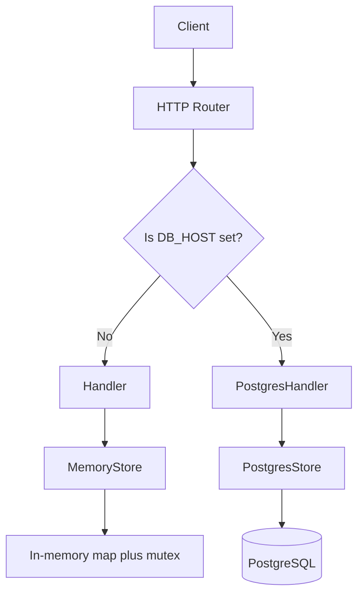

# Architecture

This project supports two storage implementations for products:

- `MemoryStore` in `internal/store/memory.go`
- `PostgresStore` in `internal/store/postgres.go`

The application chooses between them in `cmd/api/main.go`:

- If `DB_HOST` is set, it uses `PostgresStore`
- If `DB_HOST` is not set, it falls back to `MemoryStore`

## When To Use `MemoryStore`

Use `MemoryStore` when you want a simple, fast setup with no external dependencies.

Typical cases:

- local development
- early exercises or prototypes
- unit tests
- demos where data does not need to survive a restart

Why it fits:

- data is stored in a Go `map[int]model.Product`
- access is protected with `sync.RWMutex`
- IDs are generated locally with `nextID`
- there is no database connection, schema setup, or network round-trip

## When To Use `PostgresStore`

Use `PostgresStore` when the application needs persistent, shared, production-like storage.

Typical cases:

- running the API in containers or real environments
- keeping product data after restarts
- multiple application instances sharing the same data
- integration testing with realistic infrastructure

Why it fits:

- data is persisted in PostgreSQL
- IDs are generated by the database with `SERIAL`
- CRUD operations use SQL queries
- the database can be shared across processes and hosts

## Trade-Offs

### `MemoryStore`

Advantages:

- simplest implementation
- very fast for small workloads
- no setup cost
- easy to test in isolation

Disadvantages:

- data is lost when the process stops
- data is not shared across multiple app instances
- limited realism compared to production storage
- no database features such as persistence, indexing, backups, or SQL querying

### `PostgresStore`

Advantages:

- data survives restarts
- supports shared access by multiple instances
- closer to a real production architecture
- benefits from database features like durability and central storage

Disadvantages:

- more operational complexity
- requires configuration and a running database
- slower than in-memory access because of network and SQL overhead
- introduces failure modes such as connection errors or unavailable database service

## Practical Decision Rule

Use `MemoryStore` if simplicity and speed of setup matter more than persistence.

Use `PostgresStore` if correctness across restarts, shared state, and production readiness matter more than setup simplicity.

## Architecture Diagram

